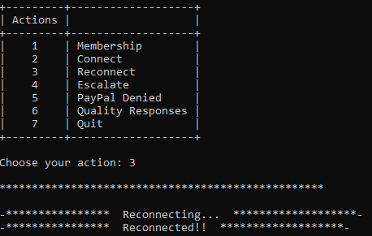

# Ticket_Handle_Copilot

## Ticket Handle Copilot - v 1.0

I automated my work by creating a ticket handle copilot using Python Selenium.
This automation allows me to handle some tickets faster because it checks in the necessary databases all the crucial information, take the necessary actions, then fills in the necessary fields in the ticket and in the end provides a standard answer to be used on the ticket.

This automation also helps me create an escalation document (Excel) when an issue needs to be escalated further, to the next level.

### Necessary libraries:

- Selenium
- openpyxl

### How it works:
#### - Ticket Handle

To start the automation we need to run the file `main.py`, after that we see the main menu.
To initiate the automation we need to type "connect", then an instance of Chrome Browser will open all the necessary web pages to work correctly. 

To activate the "ticket handle" we need to type "m", then the automation will ask us permission to handle the current ticket we're working on. 

If we press "y", the automation takes the person's email address from the ticket and go to the first database, perform the search and retreaves some account information.

Depending on the "Status" the automation will take different actions. For example, if the status is "Active" or "Sleeping", the automation takes the "ID" found in the first database and will search in a second database. 

After all the information is collected will show us a summary.

Depending on the psReason it may ask us if we want to reactivate the account and that triggers different actions. 

At the end of the process the automation fills in the necessary fields and provides a standard answer to be used on the ticket.

#### - Reconnect

If you close by accident one of the necessary tabs for the automation to work, you have to close all the remaining tabs except one, type "reconnect" and will open again all the necessary tabs. 

#### - Escalation

For the escalation process you need to choose 10 tickets with a particular issue then type "escalate" and the automation will create the Excel file necessary for the escalation. 

